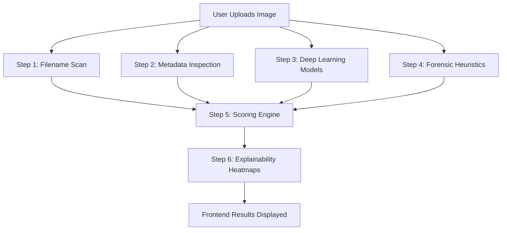

# ImgAuth AI — Project Overview & Architecture Guide

Welcome to the official documentation and technical overview of **ImgAuth AI**. This guide is designed to explain how our AI Image Authenticity Detector works in simple language, breaking down the backend analysis pipelines, the deep learning models, the forensic heuristics, the explainability heatmaps, and the frontend design.

---

## 📌 Project Goal & Philosophy

**ImgAuth AI** is a major college project developed by **Team VisionGuard** (Vishal, Prince M., Prince D., and Raksha). 

### The Core Philosophy: *“Simple on the surface, powerful underneath.”*
* **For Everyday Users**: It works like a clean, minimal SaaS tool. You drag and drop an image, click a button, and immediately get a clear binary answer: **Likely AI-Generated** or **Likely Authentic**, accompanied by a confidence percentage and three simple reasons.
* **For Investigators & Researchers**: Under a collapsed **"Show Technical Analysis"** drawer, the app reveals detailed forensic logs, individual model scores, neural network attentions, and math-heavy metrics (such as Kurtosis, Spectral ratios, and Compression ghosts).

---

## 🔄 End-to-End Image Processing Workflow

When a user uploads an image, the system processes it in six main steps:

1. **Upload & Reading**: The frontend sends the image to the FastAPI backend as a binary stream. The backend loads it using **Pillow** (PIL) and **OpenCV** in memory (without saving it to disk for privacy).
2. **Parallel Scans**: The image is fed simultaneously into four analysis layers:
   - Filename clues
   - Metadata headers
   - 3 Deep Learning neural networks
   - 5 Digital forensic algorithms
3. **Consolidation**: The **Scoring Engine** takes the probabilities from all layers, applies a dynamic weighting formula based on the strength of the clues, and calculates a final AI probability score.
4. **Heatmap Generation**: If the image contains a valid vision signature, the system runs ViT (Vision Transformer) attention scans to map exactly which parts of the image look suspicious.
5. **Response**: The server returns a structured JSON containing the verdict, final score, detailed breakdown, heatmaps, and diagnostic logs.
6. **Smooth Render**: The frontend receives the JSON, updates the visual elements, and smoothly scrolls the user down to the results.

---

## 🛡️ The Multi-Layer Detection Architecture

ImgAuth AI uses a **four-layer defense system** to catch generated media.

### Layer 1: Filename Analysis
Many AI generators assign unique default filenames to their creations. The backend scans the file name against regular expression (regex) patterns:
* **Midjourney**: Typically uses 4 dash-separated hexadecimal blocks followed by a seed number (e.g., `user_description_abcd1234-ef56-7890-abcd-1234567890ab.png`).
* **Stable Diffusion / DALL-E / Bing**: Often contain timestamps, prompt keywords, or specific prefix indicators (e.g., `DALL·E 2026-...`, `BingCreator_...`).
* **Why it matters**: If a match is found, it is a near-guarantee (92% weight) that the image is AI-generated, bypassing heavy computation or helping confirm suspect classifications.

### Layer 2: Metadata Analysis
Digital cameras embed metadata (EXIF data) inside image files containing details like camera model, exposure, GPS coordinates, and creation software. AI generators either:
* Strip all metadata completely (leaving a blank EXIF profile).
* Write their generator signature (e.g., software tags like `"Adobe Firefly"`, `"DALL-E"`, or `"Stable Diffusion"`).
* **How it works**: The backend parses the raw file bytes looking for telltale creator software tags or signs of metadata stripping.

### Layer 3: Deep Learning Ensemble
We feed the image into three separate state-of-the-art neural networks hosted on Hugging Face. Combining their opinions avoids the bias of a single model:

| Model ID | Name | Architecture Type | What It Focuses On | Weight |
| :--- | :--- | :--- | :--- | :--- |
| `umm-maybe/AI-image-detector` | **umm-maybe ViT** | Vision Transformer (ViT) | Global semantic consistency (does the overall scene make physical sense?) | 25% |
| `dima806/ai_vs_real_image_detection` | **dima806 CNN** | Convolutional Neural Network (CNN) | Local textures and pixel anomalies (brush strokes, unnatural blending) | 25% |
| `Organika/sdxl-detector` | **Organika SDXL** | Specialized CNN | Specific artifacts produced by Stable Diffusion XL generators | 25% |

---

### Layer 4: Advanced Forensic Heuristics
Deep learning models can be fooled by filters or resizing. To counter this, ImgAuth AI uses **five math-based forensic checks** that look at the physics of pixels:

#### 1. Noise Kurtosis Analysis (Weight: 8%)
* **Concept**: Real cameras capture random high-frequency thermal noise in pixels. When AI generates an image, it smooths out or over-complicates this noise.
* **How it works**: We apply a **Laplacian filter** to isolate high-frequency details (noise), flatten the pixels into a 1D list, and calculate its **kurtosis** (a statistical measure of how "peaky" or "flat" the distribution is).
  * *High Kurtosis (> 1.5)*: Leptokurtic curve. Means noise is natural and random (Likely Authentic).
  * *Low/Negative Kurtosis (< 0)*: Platykurtic curve. Means noise is highly uniform or artificially smooth (Likely AI-Generated).

#### 2. Deep Feature Inconsistency (DFI) (Weight: 7%)
* **Concept**: Generative models create images patch-by-patch, which often leads to subtle boundary mismatches between different areas of the image.
* **How it works**: We pass the image through the Vision Transformer (ViT) and extract the hidden features of the very last neural layer. We calculate the mathematical similarity (Cosine Similarity) between every single patch and the average of all patches.
  * If the variance of these similarities is high, it shows that different parts of the image have inconsistent mathematical characteristics—a classic indicator of patch-based AI generation.

#### 3. FFT Spectral Analysis (Weight: 5%)
* **Concept**: When generating an image, AI algorithms upscale pixel grids, which leaves behind faint, repeating grid-like patterns called "periodic artifacts" (invisible to the human eye).
* **How it works**: We perform a **Fast Fourier Transform (FFT)** to convert the image from pixels (spatial domain) into frequencies (spectral domain). We look for abnormal high-frequency spikes.
  * A high ratio of periodic spikes in the outer rings of the frequency map indicates unnatural, repeating grid artifacts common in AI generation.

#### 4. Color Histogram Analysis (Weight: 3%)
* **Concept**: Real photographs have smooth, gradual transitions of colors due to natural lighting. AI-generated images often have abrupt color steps or overly simplified color palettes.
* **How it works**: We plot the color histograms (Red, Green, Blue channels) and calculate the mathematical **roughness** (standard deviation of the differences between consecutive histogram bars).
  * *Rough/Jaggered histograms*: Natural transitions (Likely Authentic).
  * *Extremely smooth histograms*: Artificially simplified color distributions (Likely AI-Generated).

#### 5. JPEG Ghost Analysis (Weight: 2%)
* **Concept**: When you edit or save an image, it undergoes compression. Real images saved multiple times have complex compression "history". AI images are usually generated and saved once, exhibiting highly uniform compression.
* **How it works**: We compress the image at different quality levels (e.g., 60%, 70%, 80%) and calculate the difference between the re-compressed versions.
  * If the difference (ghost spread) is very low and uniform across the image, it suggests the image was synthetically generated and compressed only once.

---

## 🧮 Scoring Engine & Decision Logic

The scoring engine implements **dynamic weighting**. The weights of the layers shift depending on how strong the clues are:

1. **Strong Filename Trigger**: If the filename matches a generator pattern, we skip complex weights and apply:
   * **92% Filename** + **4% Metadata** + **4% Models & Forensics**
   * This immediately pushes the AI probability high while incorporating safety margins.
2. **Medium Clue / No Clue**: If the filename has no obvious markers, the weights distribute:
   * **10% Filename** + **45% Metadata** + **45% Models & Forensics**
3. **Ensemble Aggregation**: The Deep Learning models and the 5 Forensic Heuristics are aggregated based on their individual weights ($25\% + 25\% + 25\% + 8\% + 7\% + 5\% + 3\% + 2\% = 100\%$).
4. **Binary Verdict Threshold**:
   * If $\text{Final AI Score} > 50\%$, the verdict is **Likely AI-Generated**.
   * If $\text{Final AI Score} \le 50\%$, the verdict is **Likely Authentic**.
   * *Confidence Label*: Derived from how far the score is from the $50\%$ middle boundary (e.g., $95\%$ score is "Very High Confidence", $55\%$ is "Low Confidence").

---

## 📊 What the Frontend Graphs & Heatmaps Show

When analysis is complete, two visual graphs (heatmaps) are rendered under the **AI Focus Areas** tab:

### 1. AI Attention Areas (ViT Attention Map)
* **What it is**: A visual representation of where the Vision Transformer's neural layers "looked" the most when making its decision.
* **How to read it**:
  * **Red/Warm spots**: Areas where the AI model detected suspicious structures, textures, or anomalies (e.g., malformed eyes, weird background blending, or floating pixels).
  * **Blue/Cool spots**: Neutral areas that the model ignored as background or normal textures.
* **Value**: Gives the user a visual explanation of *why* the models classified the image as AI-generated.

### 2. Pattern Irregularities (DFI Heatmap)
* **What it is**: A map representing the mathematical inconsistencies (cosine distance variance) between patches of the image.
* **How to read it**:
  * **Highly fractured/hot spots**: Areas where pixel characteristics deviate sharply from the surrounding regions, highlighting copy-paste edges, localized AI inpainting, or upscaling borders.
  * **Uniform blue fields**: Smooth, physically consistent regions typical of natural, unaltered photography.

---

## 💻 Tech Stack & Component Responsibilities

The project is built entirely on a lightweight, performant, and modern Python/JS stack:

| Component | Technology | Purpose |
| :--- | :--- | :--- |
| **Server/API** | `FastAPI` (Python) | High-performance, asynchronous web server that handles API endpoints. |
| **Deep Learning** | `PyTorch` & `Transformers` | Loads and runs inference on the Hugging Face vision models. |
| **Forensics** | `OpenCV`, `NumPy`, `SciPy` | Performs fast matrix math, FFT frequency transforms, noise extraction, and image resizing. |
| **Structure** | HTML5 | Semantically structures the layout, navigation, cards, and drawers. |
| **Styling** | CSS3 (Vanilla) | Custom styling utilizing a dark premium theme, glassmorphism card surfaces, purple gradients, responsive media queries, and transition animations. |
| **Logic** | JavaScript (Vanilla) | Handles drag-and-drop file uploads, coordinates loading states, parses API JSON responses, dynamically updates the DOM, renders base64 heatmaps, and saves/retrieves history using browser `localStorage`. |
| **Deployment** | `Docker` | Containers the app, installs CPU-optimized PyTorch binaries, and pre-caches the Hugging Face models for easy hosting on Hugging Face Spaces. |
